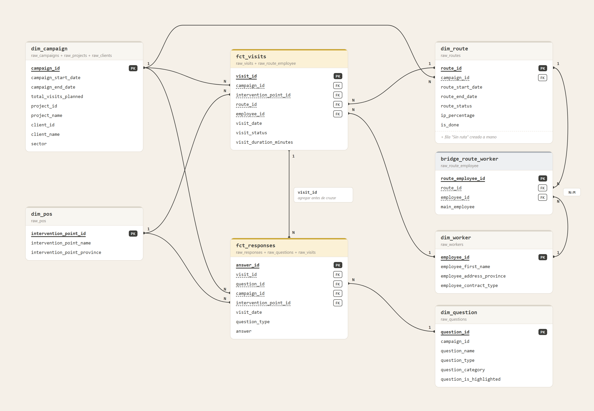
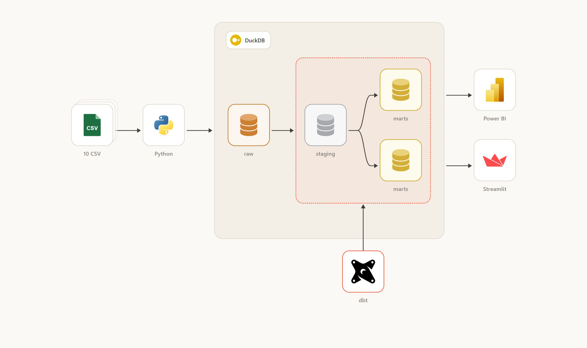

# Notes for the Data Analyst test

## 1. The question

Primer Impacto is a field marketing agency. Workers visit shops and fill in a form. The shops are pharmacies and supermarkets. We call them points of sale.

The client asks four things:

- Which projects and campaigns do we have?
- How are they going?
- Are the routes done?
- Who performs well?

Operations manages the work. Management wants one view of everything. Today there are 14 clients, 28 projects and 72 campaigns.

The brief does not say which numbers to use. We chose them. We call each one a KPI. A KPI is a number that shows if the work goes well.

## 2. First look at the data

We received 10 CSV files. A CSV file is a plain text table. Together they hold 13,737 rows. The visits go from 1 January 2026 to 19 May 2026.

We did a first analysis (EDA) in the [raw notebook](eda/raw/eda_raw.ipynb). We found these problems:

| Problem | What we did |
|---|---|
| 1 client, 2 workers and 15 visits twice | Removed the copies |
| 71 visits with no status | Kept them as "unknown" |
| 155 visits with no route, 70 with a route that does not exist | Kept them under a route called "No route" |
| 13 campaigns with no state | Work out the phase from the dates |
| 2 campaigns end before they start | Reported, not changed |
| 25 worker assignments marked as deleted | Ignored them |
| 447 answers with extra spaces around the text | Cleaned the text |
| Two date formats, different province spellings | Made them the same |

We keep every row. We never invent a value. A missing value stays empty.

## 3. Our choice is a star model

A model is the way we organise the tables. We chose a star with two centers.

- Two tables hold events: 1,747 visits and 10,192 answers.
- Other tables describe things: campaigns, points of sale, routes, workers and questions.
- One small table links routes and workers.

Why we chose it:

- One row means one thing. One row of visits is one visit.
- Reports need only simple links between tables.
- New data goes into the event tables only.

## 4. Architecture

Five steps:

1. Load: [ingest.py](src/ingest/ingest.py) copies the 10 files into DuckDB, with the types of the [schema files](src/ingest/schema). The run ends with error code 1 if a file, a column or a value fails.
2. Clean: dbt fixes text, dates and spellings in the [staging models](src/dbt/models/staging).
3. Model: dbt builds the star model and the marts in the [marts folder](src/dbt/models/marts).
4. Test: dbt runs the 163 tests. See section 6.
5. Show: Streamlit draws the dashboard from [app.py](dashboard/app.py).

Two commands rebuild everything, `ingest.py` and `dbt build`. Run them again and you get the same result. It all runs on one computer. There is no cloud and no cost.

Each load replaces the raw tables. Section 10 explains why.

## 5. From the model to the marts

The data goes through three layers inside a database called DuckDB. A tool called dbt builds each layer with SQL.

1. Raw: the files as received.
2. Staging: cleaned text, dates and spellings.
3. Marts: the star model and the tables for the dashboard.

A mart is a table made for one use. Ours feed Streamlit, a tool that makes web pages from Python. The marts read only the model, never staging. A test checks this rule.

| Mart | One row is | Built from |
|---|---|---|
| [`mart_campaign_performance`](src/dbt/models/marts/mart_campaign_performance.sql) | A campaign and a month, plus a total | `dim_campaign` and `fct_visits` |
| [`mart_pos_coverage`](src/dbt/models/marts/mart_pos_coverage.sql) | A campaign and a point of sale | `dim_campaign` and `fct_visits` |
| [`mart_route_performance`](src/dbt/models/marts/mart_route_performance.sql) | A route | `dim_route`, `dim_campaign` and `fct_visits` |
| [`mart_worker_performance`](src/dbt/models/marts/mart_worker_performance.sql) | A worker | `dim_worker`, `bridge_route_worker` and `fct_visits` |
| [`mart_visit_responses`](src/dbt/models/marts/mart_visit_responses.sql) | A form answer | `fct_responses`, `dim_campaign`, `dim_question` and `dim_pos` |

## 6. Tests and every load

dbt runs 163 tests each time we load new data. 105 are built in, 45 come from our own reusable rules and 13 are singular, with one rule each. You can see them in the [model files](src/dbt/models), the [generic folder](src/dbt/tests/generic) and the [singular folder](src/dbt/tests/singular).

- **When do they run?** Every time `dbt build` runs, after each new load. Today a person runs it. With CI/CD it would run alone.
- **What if one fails?** The build stops. The tables that depend on it keep their last good version, and the exit code is 1.
- **Do warnings stop it?** No, only errors. We have 3 warnings today, and they are real findings in the data.
- **Who is told?** Nobody yet.
- **Can we load again?** Yes. The same files give the same result.

By hand we also checked that rows go from 1,762 to 1,747 (the 15 copies), that the dashboard matches the database, and that the joins create no empty values.

## 7. Project board

The work as a small Jira board. Seven epics. Tests are part of every epic.

**DIS Discovery**

| ID | Phase | Task | Status |
|---|---|---|---|
| DIS-1 | Brief | Read the brief and the 10 files | Done |
| DIS-2 | EDA | Analyse the raw files in the [raw notebook](eda/raw/eda_raw.ipynb) | Done |
| DIS-3 | EDA | List the problems, choose the KPIs and the model | Done |
| DIS-4 | Tests | Check copies, empty values, dates and links between tables | Done |

**ING Ingestion to raw**

| ID | Phase | Task | Status |
|---|---|---|---|
| ING-1 | Schema | One schema file per table with the type of each column | Done |
| ING-2 | Load | [`ingest.py`](src/ingest/ingest.py) reads each CSV as text, sets the types and replaces the raw table | Done |
| ING-3 | Load | Read the two date formats as dates | Done |
| ING-4 | Tests | Log failed values and files, end with error code 1 | Done |
| ING-5 | Later | Load only new or changed rows if the source is live | Open |

**STG Staging**

| ID | Phase | Task | Status |
|---|---|---|---|
| STG-1 | Clean | 10 staging models, one per raw table | Done |
| STG-2 | Clean | Fix text, dates and province spellings | Done |
| STG-3 | Clean | Remove 18 copies and ignore 25 deleted assignments | Done |
| STG-4 | Tests | Row counts, key counts and text tests | Done |
| STG-5 | Later | Table of provinces instead of the manual fix | Open |

**MOD Data modeling**

| ID | Phase | Task | Status |
|---|---|---|---|
| MOD-1 | Model | Star model with 7 dimensions, 2 facts and 1 link table | Done |
| MOD-2 | Model | A "No route" row so no visit is lost | Done |
| MOD-3 | Tests | Keys, links between tables and one row per grain | Done |

**KPI Building the KPI marts**

| ID | Phase | Task | Status |
|---|---|---|---|
| KPI-1 | Marts | 5 mart tables with the KPIs chosen in discovery | Done |
| KPI-2 | Marts | One definition of "done" and of each KPI, written in SQL | Done |
| KPI-3 | Tests | Marts equal the facts, statuses add up, marts read only the model | Done |

**FRT Frontend**

| ID | Phase | Task | Status |
|---|---|---|---|
| FRT-1 | Streamlit | 2 filters and 3 tabs | Done |
| FRT-2 | Streamlit | Clear words for statuses and question types | Done |
| FRT-3 | Tests | Dashboard numbers against the database, 0 differences | Done |
| FRT-4 | Video | Short video of the dashboard | Done |

**DOC Handover**

| ID | Phase | Task | Status |
|---|---|---|---|
| DOC-1 | Docs | Notes, executive summary and dbt README | Done |
| DOC-2 | Client | Questions for the client, see section 9 | Open |
| DOC-3 | Later | Alert when a run fails | Open |
| DOC-4 | Later | CI/CD, run the load and `dbt build` on each new load | Open |

## 8. The dashboard and its KPIs

Three tabs and two filters, client and project type. It only shows numbers, and each number is calculated once in the database. The code is in the [dashboard folder](dashboard/app.py) and the details are in [dashboard.md](dashboard/dashboard.md).

<video src="docs/video/streamlit.mp4" controls width="800"></video>

[Open the video](docs/video/streamlit.mp4)

**Campaigns.** Which campaigns do we have, and how are they going?

- Visits done: 1,539. The client pays for presence in the shops.
- Points of sale covered: 248 of 250.
- Visits not done: 137 (7.8%). Paid time that was lost.
- Billable visits: 65.9%.
- Field hours: 795.7, a minimum.
- We see that 64 of 72 campaigns have visits. Eurofarma Iberia has the most visits done (239) and Biofarma España has none.
- We see that 67.3% of visits end with an incident and only 4.9% are `OK`.

**Routes and team.** Are the routes done, and who performs?

- Routes closed with no visits: 38 of 241. Planned work that did not happen.
- Visits per day: 1.1 on average.
- We see that Lucía 42 has the most visits done (107).
- 252 visits have no worker, so worker numbers are a minimum.

**Form answers.** What does the client receive?

- Points that want to order: 51.3% (172 of 335 answers).
- Training accepted: 24.1% (65 of 270 answers).

A visit is `OK` (completed), `INCID` (completed with an incident), `INFO` (information only) or `NOVIS` (not carried out). It is done when it is `OK`, `INCID` or `INFO`.

We dropped four numbers.

- Percent of plan, because the plan and the data do not match.
- Success rate, because only 4.9% of visits are `OK`.
- Campaign state, because 13 campaigns have none.
- `expected_answer`, because nobody knows what it means.

## 9. What we need from the client

The plan does not match the data. The client plans 16,768 visits and the file has 1,747. So we show no KPI against the plan.

- Is the visits file a sample? What does `total_visits_planned` count?
- What does `expected_answer` mean?
- Should a visit with status `NOVIS` have answers? All 137 do.
- Who is the main worker of the 12 routes that have none?

## 10. Doing it better

| Question | Answer |
|---|---|
| What if the client adds more data? | Put the new CSV files in the `data/raw` folder. Run `ingest.py` and `dbt build`. Each raw table is replaced and all tests run again. A new status, type or province stops the build on purpose, so we can decide what it means. Clear the Streamlit cache or restart it to see the new numbers. |
| What if the client asks "is the data real?" | We go back to raw. Raw is the file as received, only the types are set. We count the same number from raw and follow it to the dashboard. Rows go from 1,762 in raw to 1,747 after cleaning, and the 15 copies explain the difference. The [raw notebook](eda/raw/eda_raw.ipynb) shows each check. What is missing is a comparison with the client's own database. |
| How does the load to raw work? | [`ingest.py`](src/ingest/ingest.py) reads each CSV as text. The schema file of the table sets the types, and two date formats are read as dates. Then it replaces the raw table. A value that cannot be converted becomes empty and goes to the log. A missing file or column also goes to the log and that table is skipped. The run ends with error code 1 if anything failed. |
| Why full reload and not update or incremental? | See the table below. |

| Option | How it works | Do we use it? |
|---|---|---|
| Full reload | Replace each raw table from the files every time | Yes, today. The data is small (13,737 rows, about 30 seconds), the files do not change, the result is the same every run, and no changed or deleted row can be missed |
| Update | Update the changed rows by key and add the new ones | Later, if the source is live. It needs `updated_at_sys` and a key |
| Incremental | Load only the rows newer than the last load | Later, if the data grows. It needs the last load date and `deleted_at` for deletions. The files have exact copies, so we also need a rule for the key |

Next steps:

- Send an alert when a run fails.
- Run the load and `dbt build` in CI/CD on each new load.
- Add a table of provinces.
- Add tests that compare answers with the visit status.
- Compare the files with the client's own database.

Limits today:

- The client has not seen these numbers yet.
- Worker numbers are a minimum, 252 visits have no worker.
- There is no version history of the database, only a dated copy.
