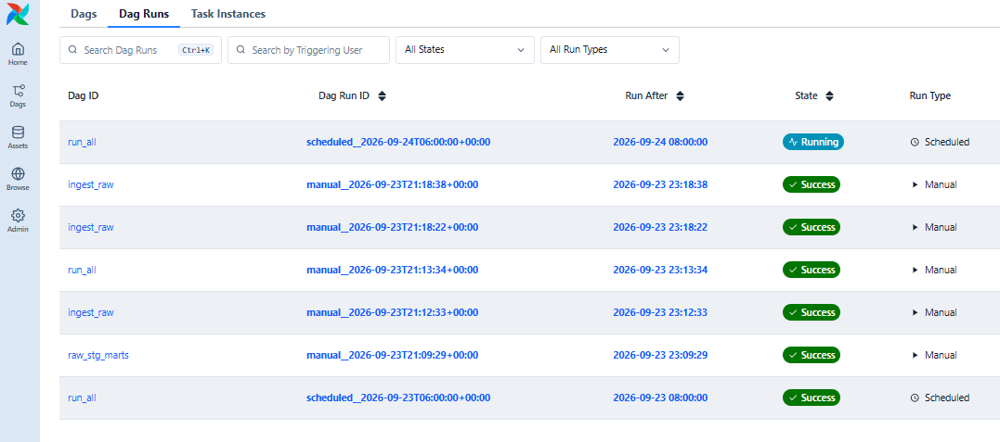

# Airflow notes

The Docker image and the DAG setup are reused from a personal project of mine, adapted to this pipeline.

## DAGs

Three simple DAGs in airflow/dags, sharing the same tasks from airflow/dags/utils/steps.py:

| DAG | What it does | Trigger |
|---|---|---|
| ingest_raw | Runs the ingestion only, to check the raw load | Manual |
| raw_stg_marts | Runs dbt only (raw to staging, then staging to marts) | Manual |
| run_all | Runs everything: ingestion, then dbt | Daily, 06:00 UTC |

The first two are for testing each part alone. run_all is the real pipeline.

