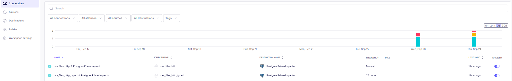
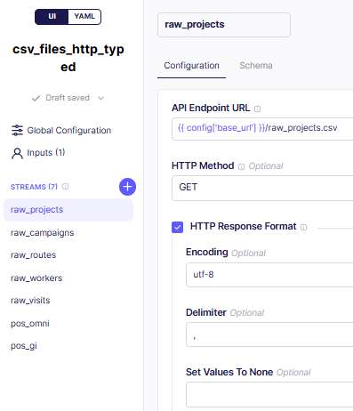
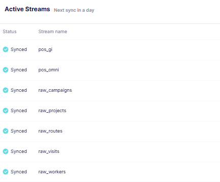

# Ingestion notes

## Airbyte setup (abctl)

Followed the official quickstart (https://docs.airbyte.com/platform/using-airbyte/getting-started/oss-quickstart):

1. Docker Desktop installed (prerequisite, already had it).
2. `abctl version` to confirm abctl is installed.
3. `abctl local install`
4. Confirm at `http://localhost:8000`.

Destination Postgres created and working: host <HOST_IP>, port 5432, database PrimerImpacto, schema public, SSL disable.

## Known issue: the File source could not reach the CSVs

The root cause is networking. abctl runs Airbyte inside a Kubernetes cluster (kind), which itself runs inside a Docker container. So there are three layers between the connector and the CSVs:

1. **Pod**: where the source connector actually runs.
2. **Docker container**: the kind node that hosts the pods.
3. **Localhost**: my machine, where data/raw lives.

`localhost` inside the pod is the pod itself, not my machine, so neither of the two built-in options of the File source could cross those layers:

- `HTTPS: Public Web`: not compatible, rejects the self-signed cert.
- `Local Filesystem (limited)`: not compatible with abctl, only sees the pod's filesystem.

### Solution: custom connector with the Connector Builder

Instead of the File source, I built a custom source in Airbyte's Connector Builder that reads the CSVs over HTTP from the host IP. These are the `csv_files_http` and `csv_files_http_typed` sources, both syncing into Postgres PrimerImpacto (see the screenshots in this note). Per-connector JSON config lives in ingestion/sources/ and ingestion/destinations/ (README's actual requirement).

## Fields per source, for reference

Match the values in each ingestion/sources/<source>.yaml:

- Storage Provider: HTTPS
- URL: https://<HOST_IP>:8080/<file>.csv
- Dataset Name: same as the file name, e.g. raw_projects
- Format: csv

## Sync mode by connection type

| Fichero | File -> Postgres | Postgres -> Postgres | Primary key | Cursor |
|---|---|---|---|---|
| raw_projects | Full refresh \| Overwrite+Deduped | Incremental \| Append+Deduped | project_id | updated_at |
| raw_campaigns | Full refresh \| Overwrite+Deduped | Incremental \| Append+Deduped | campaign_id | updated_at |
| raw_routes | Full refresh \| Overwrite+Deduped | Full refresh \| Overwrite+Deduped | route_id | none |
| raw_workers | Full refresh \| Overwrite+Deduped | Full refresh \| Overwrite+Deduped | employee_id | none |
| raw_visits | Full refresh \| Overwrite+Deduped | Incremental \| Append+Deduped | visit_id | updated_at |
| pos_omni | Full refresh \| Overwrite+Deduped | Incremental \| Append+Deduped | intervention_point_id | updated_at |
| pos_gi | Full refresh \| Overwrite+Deduped | Full refresh \| Overwrite+Deduped | ext_id | none |

**Note: The Postgres-Postgres column is a test to verify it works correctly. The File->Postgres is the real.

### Local alternative: ingestion/core

While the Airbyte source was blocked, I built a local Python loader in ingestion/core (ingestion.py) so the project could keep moving in case no Airbyte solution was found. It loads the same CSVs into the raw schema and is still available as a fallback.

### Test

To check that everything is okay, I run the ingestion process through Python, in /ingestion, where I use libraries like sqlalchemy, dotenv, json, sys. Then, to check that Airbyte works, since I can't access the local filesystem, I check a sync between the same sources like this:

