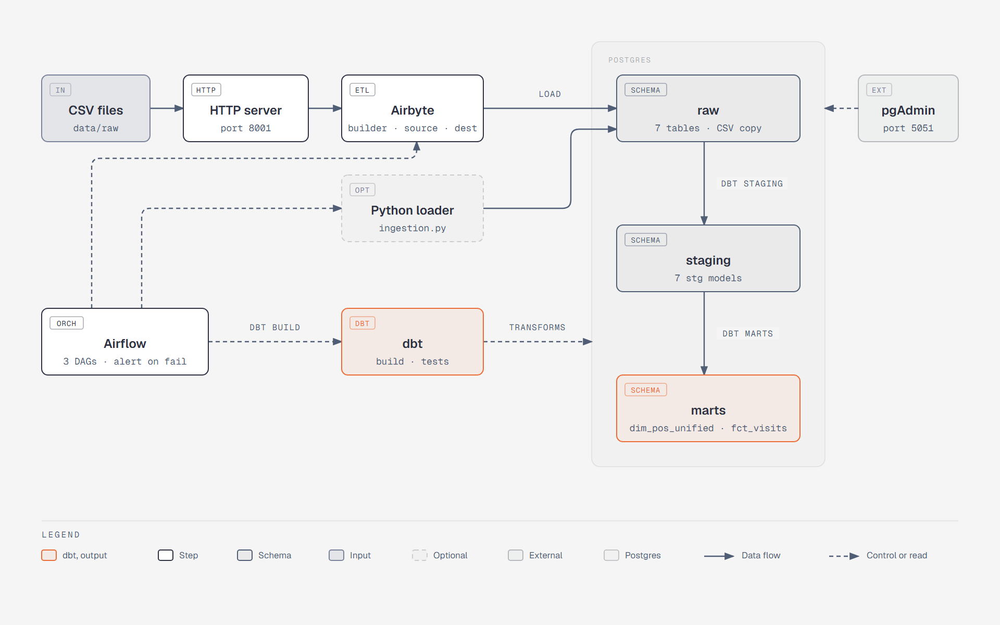
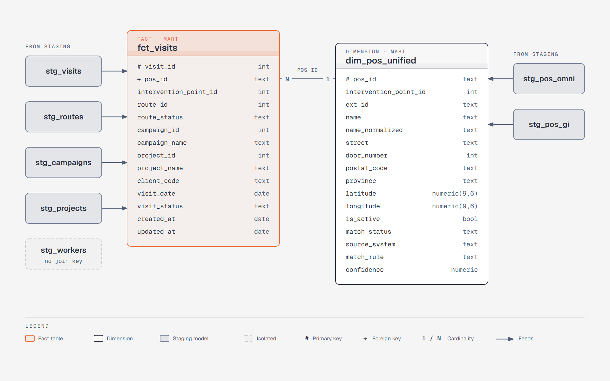

# Init

Starting point to work with. Two pictures: how the pipeline is built, and where the data modeling ends.

## Architecture

CSV files are served over HTTP, loaded into Postgres `raw` by Airbyte (or a Python loader), cleaned by dbt staging and modeled by dbt marts. Airflow runs it and alerts on failure.

## Data model

The goal of the modeling: one fact table and one dimension.

- `fct_visits`: one row per visit.
- `dim_pos_unified`: one row per real point of sale, joined by `pos_id`.

