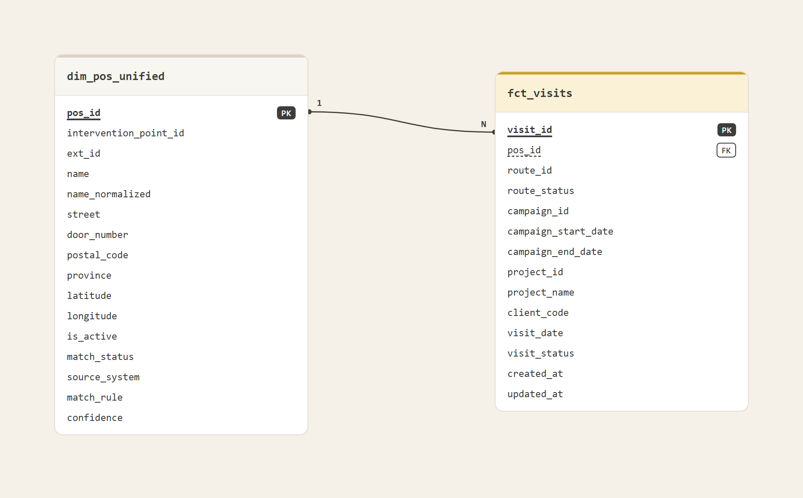
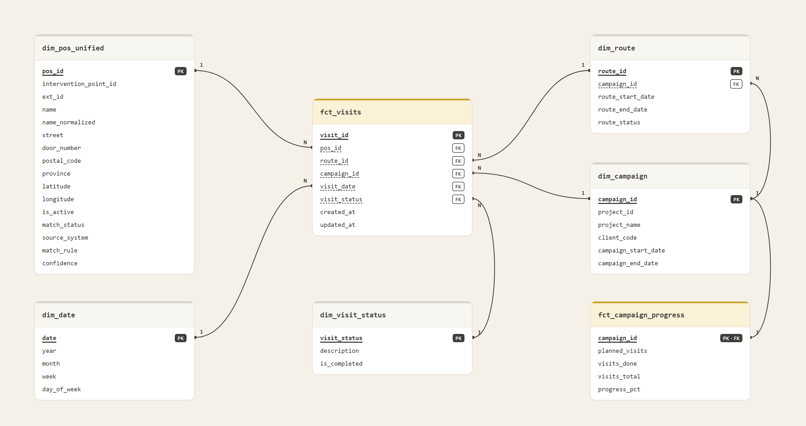
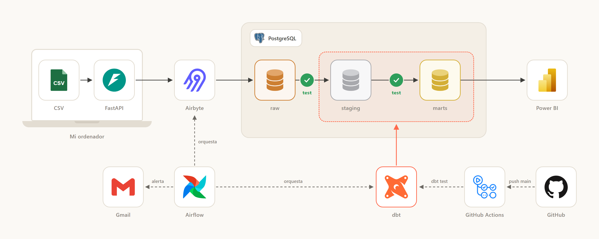
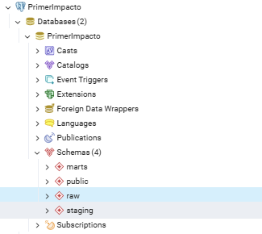
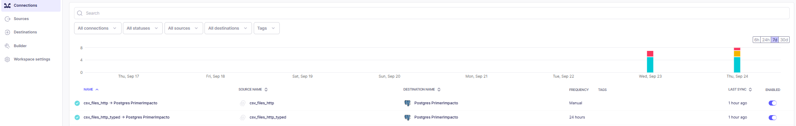
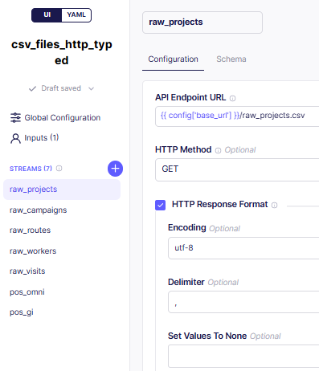
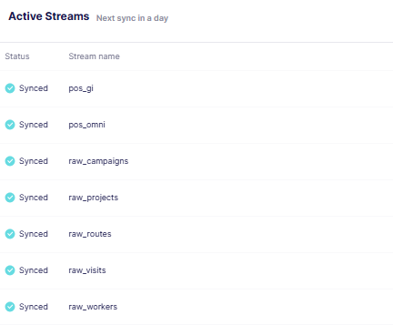
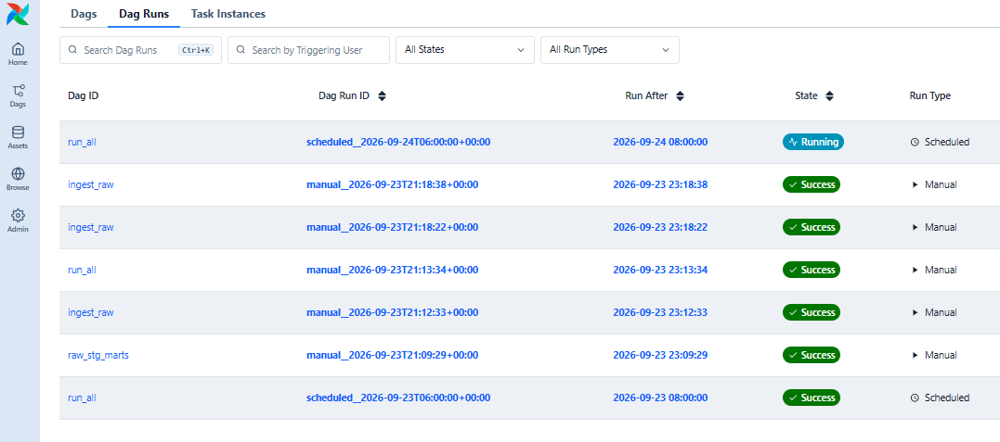

# Notes for the Data Engineer test

Summary of the project, decisions and limits. The original brief is in the [README](README.md).

Assumed things are marked `[assumed]`. Things only the client can answer are marked `[ask client]`.

Contents.

1. The question
2. First look at the data
3. Star model
4. Architecture
5. How it was built
6. Marts
7. Tests
8. What the frontend will read
9. What we need from the client
10. Doing it better
11. Decisions and why
12. When something breaks
13. Tasks
14. Conclusions

## 1. The question

Workers visit stores and record how each visit went. The same store lives in two systems that share no id, so nobody can count visits by store, campaign or client with trust.

The brief asks for three things.

- One reliable list of stores.
- One visits table that reloads every day without losing or repeating data.
- Final tables that can be used without more cleaning.

| Question | Answer | Status |
|---|---|---|
| Who uses the data? | Campaign managers, visit level and campaign totals `[assumed]` | `[ask client]` |
| Who owns each source? | Omni is our own system, gi is a partner, the rest comes from the client | `[ask client]` |
| Who wins when sources disagree? | Omni wins and gi fills gaps. Our decision | To confirm |
| How fresh must the data be? | Not stated. Daily run at 06:00 `[assumed]` | `[ask client]` |
| Static or live data? | Static files. Full load in raw, incremental in `fct_visits` | Answered |
| Can data be lost? | No. Postgres with ACID, BASE is not needed | Answered |
| Sensitive data? | `raw_workers` has names and addresses. Not used in the model | Answered |
| Local or cloud, who runs it, cost? | Local with Docker, no cost. Who runs it later is unknown | `[ask client]` |
| Time zone and alert owner? | Not stated. Alert is a log line plus an untested email | `[ask client]` |
| Did the client check the result? | No | `[ask client]` |

## 2. First look at the data

7 CSV files, 1,457 rows, visits from 2 January to 8 September 2026. Read as text, before any change.

| Source | Rows | Key | Repeated keys | Empty values | Sensitive |
|---|---|---|---|---|---|
| `raw_visits` | 480 | `visit_id` | 0 | `visit_status` (14) | No |
| `pos_omni` | 365 | `intervention_point_id` | 0 | none | No |
| `pos_gi` | 245 | `ext_id` | 0 | none | No |
| `raw_routes` | 295 | `route_id` | 0 | `route_status` (10) | No |
| `raw_campaigns` | 16 | `campaign_id` | 0 | none | No |
| `raw_projects` | 11 | `project_id` | 0 | none | No |
| `raw_workers` | 45 | `employee_id` | 0 | one contract type | Yes |

Checked in three notebooks: [raw](eda/raw.ipynb), [staging](eda/stagging.ipynb) and [marts](eda/marst.ipynb).

| Problem | What we did |
|---|---|
| 14 visits and 10 routes with no status | `UNKNOWN`, never delete |
| Visit status written 9 ways for 4 states | Trim and upper case |
| Province written 53 ways for 48 | Trim and upper case |
| Double spaces and `S.L.` only in gi (49 and 48 names) | Macro that normalizes names |
| 39 stores with one wrong digit in the postal code | Second matching rule |
| 80 visits outside campaign dates, 47 outside route dates | Kept, warning tests |
| 189 of 480 visits go to inactive stores | Real source data, `[ask client]` |
| Campaigns 4, 9 and 12 have strange planned visits | Copied as they are, `[ask client]` |
| Coordinates do not fit the province | Not used |
| `raw_workers` shares no key with other tables | Left out |
| Airbyte adds `_airbyte_*` columns | Staging picks columns by name |

We keep every row. We never invent a value.

## 3. Star model

The first delivery had one dimension and one wide fact table (version 1). The improvement splits attributes into small dimensions and keeps only keys in the fact (version 2). The built model follows version 2: ids became keys (`pos_key`), `dim_pos_unified` is now `dim_pos`, every dimension has a `-1` row, and status and date have their own keys.

Why.

- One row means one thing. One row of `fct_visits` is one visit.
- If a dimension changes, old visits are not stale and the fact needs no reload.
- A visit with no store, route or campaign points to `-1` and is not lost.
- Planned visits live in their own table, because they have a different grain.

## 4. Architecture

Target picture. Today the file server is a small Python HTTP server, the frontend is not built and the CI file is a draft.

1. Load. Airbyte reads the 7 files over HTTP and writes them to Postgres `raw` as text. A Python script does the same as backup.
2. Clean. dbt fixes types, text and spellings in staging.
3. Model. dbt builds the star model in marts.
4. Test. dbt runs the tests, see section 7.
5. Run. Airflow runs everything every day and logs a failure line.

All on one computer. No cloud, no cost.

## 5. How it was built

Install and run commands (Docker, `uv`, `abctl`, dbt) live in the README of each folder, not here.

**Services.** Postgres, pgAdmin, the file server and Airflow run in Docker. No password or IP in the code, every file reads a name from `.env`.

**Airbyte.** Installed apart with `abctl`. Destination is Postgres, schema `public`, SSL disabled.

**Own source.** Airbyte offered three ways to read the CSV files.

| Option | Result |
|---|---|
| File connector over HTTPS | Rejects the self signed certificate, no SSL toggle |
| File connector, local filesystem | Only sees the container, setup needs variables that exist only in the Docker Compose install, not in `abctl` |
| Connector Builder over plain HTTP | Chosen. We built the source ourselves |

Publishing failed at first with no declarative manifest for major version 7. We added that row to `declarative_manifest_image_version` in the Airbyte database. Details in [ingestion/note.md](ingestion/note.md).

**Sync.** Airbyte reads the files from a web server on port 8001. Mode is Full refresh, Overwrite on all 7 streams.

| Source | Primary key | Cursor in the file |
|---|---|---|
| `raw_projects` | `project_id` | `updated_at` |
| `raw_campaigns` | `campaign_id` | `updated_at` |
| `raw_routes` | `route_id` | none |
| `raw_workers` | `employee_id` | none |
| `raw_visits` | `visit_id` | `updated_at` |
| `pos_omni` | `intervention_point_id` | `updated_at` |
| `pos_gi` | `ext_id` | none |

Why full.

- Small static files, so rereading costs nothing and no row is missed.
- Incremental on the file source with `updated_at` loaded only 1 or 2 rows in `pos_omni`, `raw_campaigns`, `raw_projects` and `raw_visits`, because the CSV is not sorted by `updated_at`.
- `raw_routes`, `raw_workers` and `pos_gi` have no `updated_at`.
- Incremental from Postgres to Postgres was tested only to see it works. It is not in the real load.

**Backup loader.** A Python loader loads the same 7 files as text and stops with code 1 on a bad header or a repeated key. Airflow chooses Airbyte or Python per run with the parameter `ingestion_mode`.

**dbt.** Reads Postgres values from `.env` through `profiles.yml`. The first run, and the first after a schema change, needs a full refresh because `fct_visits` stops when its columns change. Later runs are a normal `dbt build`.

**Airflow.** Three DAGs share the same tasks.

| DAG | What it does | Trigger |
|---|---|---|
| `ingest_raw` | Ingestion only | Manual |
| `raw_stg_marts` | dbt only, staging then marts | Manual |
| `run_all` | Ingestion then dbt. Two retries, 15 minutes per task | Daily 06:00 UTC |

The first two test each part alone. `run_all` is the real pipeline. dbt is split by layer, with tests inside each build, and there is no trigger between DAGs.

**Check.** The three notebooks in `eda` show nulls, keys, spaces, `-1` rows and 480 rows in raw, staging and the fact. The tests must end with no error.

## 6. Marts

Three layers in Postgres: raw (files as received, all text), staging (clean types, one model per file) and marts (star model).

| Table | One row is | Built from |
|---|---|---|
| `dim_pos` | A real store | `stg_pos_omni`, `stg_pos_gi` |
| `dim_campaign` | A campaign with project and client | `stg_campaigns`, `stg_projects` |
| `dim_route` | A route with its campaign | `stg_routes` |
| `dim_date` | A day | All dates found |
| `dim_visit_status` | A visit status (seed) | `dbt/seeds/marts` |
| `fct_visits` | A visit | `stg_visits` and dimensions |
| `fct_campaign_progress` | A campaign, planned against done | `stg_campaigns`, `fct_visits` |

Two macros clean text. `clean_string` trims, collapses spaces and turns empty text into null. `normalize_string` also lowers case and removes a final `S.L.` or `S.A.`, so names compare between omni and gi. Example: `  FarmaVida  Estación 3  S.L. ` becomes `farmavida estación 3`.

Rules.

- Every dimension has a `-1` row, a placeholder called UNKNOWN. If a visit points to a store, route or campaign that does not exist, its key becomes `-1` instead of null, so the join keeps the visit and it shows up as "unknown store" in reports.
- `fct_visits` has only keys, `visit_date`, `updated_at` and two flags, `is_completed` and `is_incidence`.
- `total_visits_planned` lives only in `fct_campaign_progress`, because in the fact it would repeat for every visit.
- A visit is completed when its status is OK or INCID `[assumed]`. The rule is in the seed.
- Contracts are enforced, so a column change stops the build.

**Store matching.** Two rules, one to one. Highest confidence wins, lowest id on a tie. Only the postal code is used to block candidates: Localidad and Poblacion are fake labels and `pos_gi` has no province.

| Rule | Condition | Confidence | Pairs |
|---|---|---|---|
| 1 | Same normalized name and postal code | 1.0 | 161 |
| 2 | Same normalized name, street and number, postal code one apart | 0.8 | 39 |

Result: 200 matched, 165 omni only, 45 gi only. That is 410 stores plus the `-1` row. Lower case alone finds 103 in both systems, the normalized name finds 200.

- False positives: 0. All 200 pairs agree on columns the rules do not use, such as `is_active` and locality.
- False negatives: 0 seen, upper limit about 1.8 percent at 95 percent confidence. No unmatched store shares street and number or has a postal code at distance 0 or 1.
- Limit: indirect proof, and the 45 gi stores have a street with no number. A sample should be confirmed `[ask client]`.
- No text similarity: it adds no pair here and raises the risk of a false match, which is worse than a duplicate `[assumed]`.
- Thresholds are in `vars` of `dbt_project.yml`.

## 7. Tests

Every `dbt build` runs 108 data tests and 8 unit tests. Airflow does it daily and a person can too.

- If one fails, the build stops before the next layer. Raw is never touched.
- Warnings do not stop it. There are 3, all real findings: 5 visits with odd dates, 80 outside campaign dates, 47 outside route dates.
- A second run leaves 480 rows and no duplicates.
- Checked by hand: 480 rows in raw, staging and fact, a `-1` row in every dimension, no visit pointing to `-1` for store, route or campaign. 14 visits are `UNKNOWN`.
- Last full build: 130 items, 127 passes, 3 warnings, 0 errors.

## 8. What the frontend will read

Not built. Each number should be calculated once in the database. It will read `fct_visits` and `fct_campaign_progress` with the dimensions.

Campaign 12 plans 2000 visits and has 16, and campaigns 4 and 9 plan 1 and have 20 and 58. We do not publish a completion rate until the client confirms.

## 9. What we need from the client

- Who reads the result and what do they need?
- Is the planned number real? Campaigns 4, 9 and 12 look wrong.
- Why do campaigns 1, 4 and 9 visit inactive stores almost every time?
- Which dates are right for the 105 visits outside campaign or route dates?
- What do INFO, NOVIS and GRABADO mean, and does INCID count as completed?
- How late can a visit be corrected?
- Should stores that exist in one system only stay in the dimension?
- How fresh must the data be, and who gets the alerts?

## 10. Doing it better

| Question | Answer |
|---|---|
| The client adds more data | Put files in `data/raw`, load and `dbt build`. A new status or column stops the build on purpose |
| The client asks "is the data real?" | Go back to raw, which is the file as received. Missing: a comparison with the client's database |
| Why full load in raw? | Small static data, same result each run, no changed or deleted row missed |

If bigger: cloud warehouse, dbt with Cosmos, snapshots (SCD2), git with Slim CI and `sqlfluff`, secrets manager, frontend deployed in a separate flow that runs only if the dbt CI passes.

Next steps.

- Turn on the CI draft.
- Test the alert email and name who receives it.
- Run the Airflow DAG from start to end with the new schema.
- Decide if `dim_visit_status` stays a seed.
- Set a real freshness limit. Today it warns after 7 days and fails after 30 `[assumed]`, and warns on every source because the load is from 2026-09-24.

Limits today.

- The client has not seen these numbers.
- Store matching has no check against a client list.
- A source change that does not move `updated_at` is not seen.
- A visit that pointed to `-1` because its store or route arrived late is not fixed until its `updated_at` changes or the fact is rebuilt in full. A unit test covers it.
- The Airflow task that calls the Airbyte API, the alert email and a full `run_all` with the new schema were not checked from start to end.
- No backups and no extra environments.
- Some first version files keep old names, for example `requirements.md` and `docs/phase2`.

## 11. Decisions and why

| Decision | Why |
|---|---|
| Airbyte with our own source and a Python backup | The File connector rejects the self signed certificate |
| Full refresh syncs | A cursor dropped rows when the CSV was not sorted |
| Raw as text, as received | Clean only in staging |
| Daily batch, no streaming | Files are static and small |
| Postgres 16 in Docker | Local, free, same engine for dbt and Airflow |
| Fact with keys only | The wide fact left old attributes in old visits |
| `-1` row in every dimension | No visit is lost |
| `pos_key` is an md5 of the omni id, or the gi id if omni is missing | Stable if the matching rule changes |
| Two matching rules, no text similarity | Explainable, and similarity adds no pair here |
| Empty status becomes `UNKNOWN` in staging | One place to clean, protected by a test |
| Current state of stores and routes, no history | `pos_omni` has no end date. SCD2 is only reasoned |
| `dim_campaign` is flat | 16 campaigns and 11 projects, a snowflake adds nothing |
| `total_visits_planned` only in `fct_campaign_progress` | Different grain |
| Workers left out | No shared key, and the data is personal |
| No `dbt_utils` or other packages | `md5`, `generate_series` and own tests are enough |
| Contracts and stop on schema change | Better to stop than to load a different schema |
| Thresholds in `vars` | No values written by hand in SQL |
| Three Airflow DAGs, dbt split by layer | Each part is tested alone, tests run inside each build |
| Airflow chooses Airbyte or Python per run | The backup stays usable without code changes |

## 12. When something breaks

| Symptom | What to do |
|---|---|
| An Airflow task fails | Read the `PIPELINE FAILED` line, which names the task. It already retried twice. Fix the cause and clear the task |
| Ingestion ends with code 1 | Look at the stage. Mapping means CSV columns changed. Validation means a repeated key. Raw is not changed |
| The Airbyte sync never ends | Check the file server runs and `FILES_URL` uses the machine IP, not localhost. Cancel the job and retry |
| A dbt test fails | The build stops before the next layer. Run `dbt build` for that model to see the rows |
| `fct_visits` looks old or wrong | Rebuild it in full from staging with `DBT_FULL_REFRESH=true dbt run` |
| Run everything again | Start `run_all`. It is safe to repeat |

To undo the Airbyte manifest change: `delete from declarative_manifest_image_version where major_version = 7;`. There is no backup of the data.

## 13. Tasks

The work as epics, tasks and subtasks. Names are general on purpose.

**Epic 1. Ingestion (raw)**

| Task | Subtasks |
|---|---|
| 1.1 Land the source data | Connect each source. Load as text. Keep raw unchanged |
| 1.2 Choose the load strategy | Compare full and incremental. Test on one source. Record the decision |
| 1.3 Keep a backup path | Write a second loader. Validate header and keys. Make it selectable per run |

**Epic 2. Clean data (staging)**

| Task | Subtasks |
|---|---|
| 2.1 Standardize | Fix types. Fix text and spellings. Fix dates |
| 2.2 Handle empty values | Set a visible default. Keep every row. Document each decision |
| 2.3 Protect quality | Test keys. Test allowed values. Test row counts |

**Epic 3. Model (marts)**

| Task | Subtasks |
|---|---|
| 3.1 Design | Define the grain. Define the keys. Split dimensions and facts |
| 3.2 Reconcile entities | Normalize names. Define matching rules. Check false matches |
| 3.3 Protect the model | Add an unknown row per dimension. Enforce contracts. Test relationships |

**Epic 4. Operate**

| Task | Subtasks |
|---|---|
| 4.1 Load the fact incrementally | Compare against the table. Unit test a late correction |
| 4.2 Orchestrate | Set dependencies. Set the schedule. Set retries and timeouts |
| 4.3 Observe | Alert on failure. Log a run id. Write a recovery guide |

## 14. Conclusions

**What we delivered.** A daily pipeline on one computer: Airbyte (with a Python backup) loads 7 CSV files into Postgres, dbt cleans and models them into a star model, and Airflow runs it every day at 06:00 UTC.

**What we can prove.**

| Claim | Evidence |
|---|---|
| No row lost or repeated | 480 visits in raw, staging and fact. A second run leaves 480 and no duplicates |
| Data is tested | 108 data tests and 8 unit tests, 127 passes, 3 warnings, 0 errors |
| Stores are one list | 410 stores from two systems, 200 matched with two explainable rules, 0 false positives and 0 false negatives seen |
| Late corrections are not lost | Row by row compare in `fct_visits`. The old 3 day window left 470 of 480 visits out |
| Odd data is kept, not hidden | 14 `UNKNOWN` statuses, 189 visits to inactive stores, 80 and 47 visits outside dates. All flagged, none corrected |

**Why it is built this way.**

- Full refresh in raw: small static files, and a cursor on the CSV dropped rows.
- Star model with a `-1` row in every dimension: one row means one thing and no visit is lost.
- Two matching rules and no text similarity: a false match is worse than a duplicate.
- Contracts that stop the build: better to stop than to load a different schema.

**What is not closed.**

- The client has not validated the numbers. Campaigns 4, 9 and 12 and the inactive stores need an answer before any completion rate is published.
- The alert email, the Airbyte call from Airflow and a full `run_all` with the new schema were not checked from start to end.
- There are no backups and one environment only.
- `updated_at` has no time, and changes that do not move it, or deletes, are not seen.

**Next steps, in order.**

1. Client validation of the doubtful numbers.
2. CI active on each pull request.
3. Alert email tested, with a named receiver.
4. Backup and a restore test.
5. Dev, test and production environments if the project grows.
